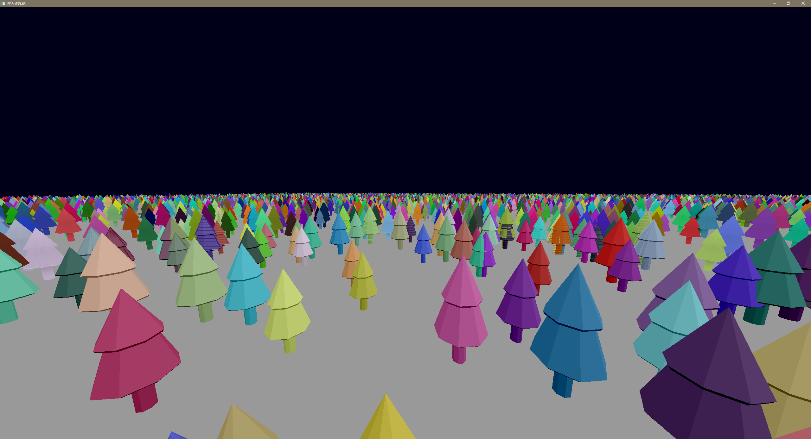
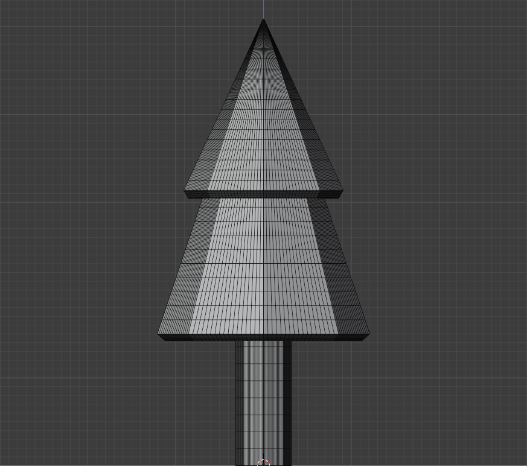
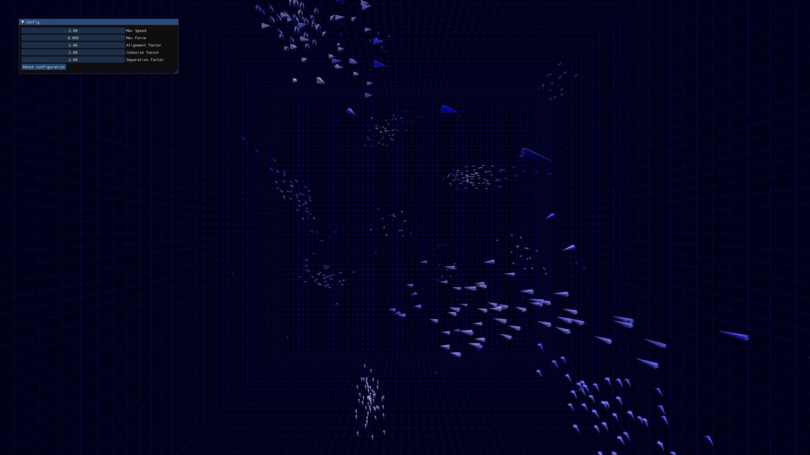
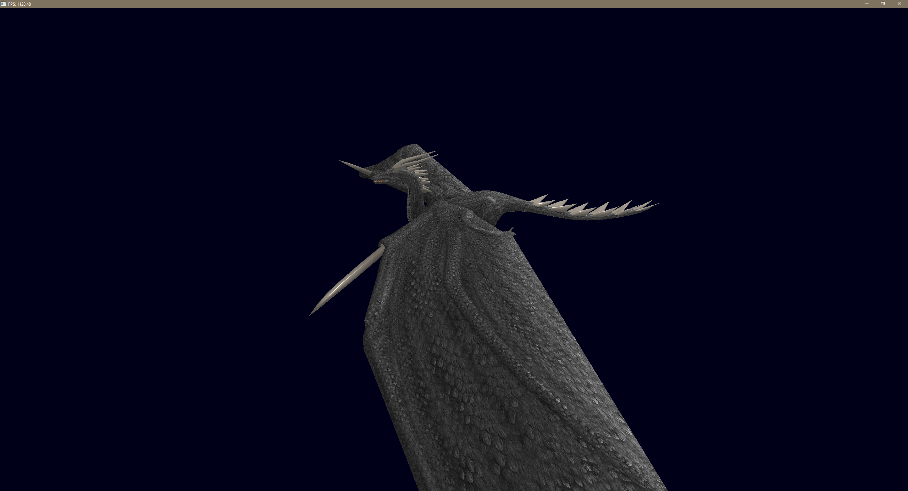
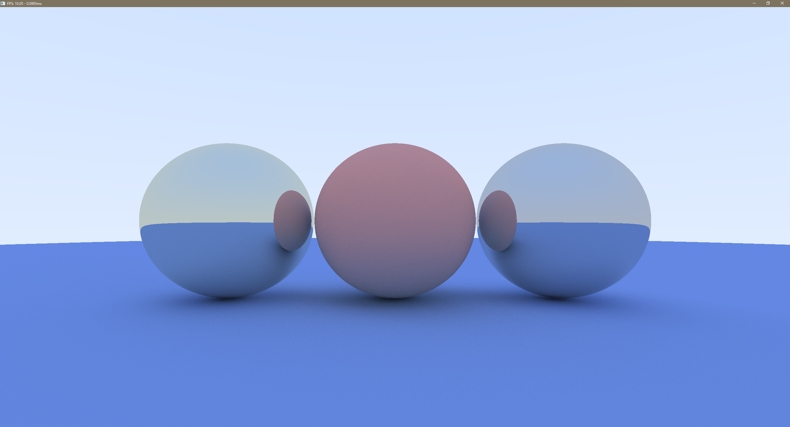

# GLSandbox

This repository is used to try out stuff using OpenGL.

You can switch between projects using build configurations. Each project use a specific build configuration specified in the project description below. They are by default built with optimizations.

Global controls: 
- `ESC` at any time to close the window.
- `W/Z`: Move forward.
- `S`: Move backward.
- `Left Click Drag`: Orbit around origin.

Some more controls may apply to specific games.

## BatchRenderingGame

- Project entrypoint [here](./OpenTKTesting/Game/BatchRenderingGame.cs).
- Build Configuration: `BatchRendering`

Meant to try out batch rendering with impostors in distance, and real mesh for close up details. A small dithering effect has been implemented to fade between impostors and meshes. 

Not everything is optimized, code isn't clean, as I made this project in a 3-4h (didn't have time to polish it yet), this is just a PoC that I may improve in the future.

### Controls:

- `Left Shift`: Increase view distance.
- `Left Control`: Decrease view distance.

### Screenshot:

### Notes:

Even though the [tree model](./OpenTKTesting/Assets/tree2.gltf) looks low poly, each face has been subdivided several times in Blender to increase its rendering time. In total the mesh counts 16320 vertices and 32502 triangles (data from Blender's statistics).

## BoidsSimulationGame

- Project entrypoint [here](./OpenTKTesting/Game/BoidsSimulationGame.cs).
- Build Configuration: `Boids`

Sebastian Lague's [video](https://www.youtube.com/watch?v=bqtqltqcQhw) made me want to do my own version of it. You can see his other work on his [YouTube channel](https://www.youtube.com/c/SebastianLague) or on his [GitHub](https://github.com/SebLague)

The colors of each boids depends on the number of boid it perceives, the more they are, the whiter the boid becomes.

This project also gave me the opportunity to use [ImGui.NET](https://github.com/mellinoe/ImGui.NET/).

### Screenshot:

## SceneRendererGame

- Project entrypoint [here](./OpenTKTesting/Game/SceneRendererGame.cs).
- Build Configuration: `SceneRenderer`

Meant to try out mesh rendering imported with Assimp. 

### Screenshot:

## RayTracingGame

- Project entrypoint [here](./OpenTKTesting/Game/RayTracingGame.cs).
- Build Configuration: `RayTracing`

Meant to discover a bit of what Compute Shaders can do. Direct implementation of [Ray Tracing in One Weekend](https://raytracing.github.io/).

### Screenshot:

