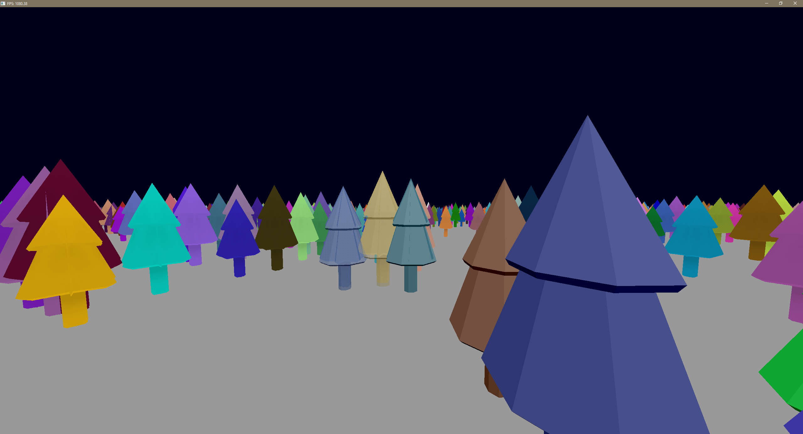

# GLSandbox

This repository is used to try out stuff using OpenGL..

You can switch between projects in the Program.cs file. Each project is referred as a "Game".

## BatchRenderingGame

Project entrypoint [here](./OpenTKTesting/Game/BatchRenderingGame.cs).

Meant to try out batch rendering with impostors in distance, and real mesh for close up details. A small dithering effect has been implemented to fade between impostors and meshes. 

Not everything is optimized, code isn't clean, as I made this project in a 3-4h (didn't have time to polish it yet), this is just a PoC that I may improve in the future.

### Controls:
- W/Z: Move forward.
- S: Move backward.
- Left Click Drag: Orbit around origin.
- Left Shift: Increase view distance.
- Left Control: Decrease view distance.

### Screenshot:

### Notes:

Even though the [tree model](./OpenTKTesting/Assets/tree2.gltf) looks low poly, each face has been subdivided several times in Blender to increase its rendering time. In total the mesh counts 16320 vertices and 32502 triangles (data from Blender's statistics).

